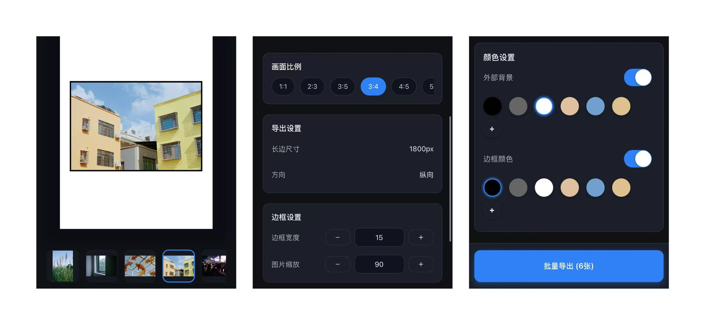

# 📸 批量边框助手

<div align="center">
  
  <p><b>一键为照片添加专业边框，轻松打造相册质感</b></p>
</div>

---

## 🚀 项目简介

**批量边框助手** 是一款基于微信小程序开发的批量双层照片装裱工具。
它以外层留白画布和内层风格边框统一处理整组照片，支持比例调整、批量处理和保存到相册。

项目使用微信小程序官方框架构建，界面简洁，操作直观，适合摄影爱好者与设计师使用。

最适合发小红书。

---

## 🧩 功能特性

- ✅ **内层胶片黑边**：支持无内框、经典细黑边、全幅扫描边、片门压框、35mm 负片、120 中画幅和乳剂破损边
- ✅ **实时预览**：边框厚度、比例即时可视化  
- ✅ **比例选择**：支持宽屏、竖屏、自定义比例  
- ✅ **批量处理**：一次导入多张照片并自动生成  
- ✅ **图片导出**：一键保存到相册  

正式编辑入口为运行路径 `pages/frame/frame`（源码位于 `miniprogram/pages/frame/`），编辑页采用预览始终可见的固定工作台。预览和导出共用 `miniprogram/core/compositeRenderer.js`；暗房扫描边和粗粝显影边使用本地分片 Alpha Mask，并按每张图片稳定的 seed 选择变体。不添加滤镜、颗粒、漏光、日期或文字编号。安全检测仍由现有云函数链路负责，边框渲染不会绕过审核流程。

生产边框视觉对比见 [`docs/production-frame-review/full-contact-sheet.png`](docs/production-frame-review/full-contact-sheet.png)，真机回归步骤见 [`docs/fixed-editor-and-frame-qa.md`](docs/fixed-editor-and-frame-qa.md)。生产遮罩和卡片预览可分别由 `tools/generate-frame-mask-assets.py`、`tools/generate-frame-previews.py` 使用固定 seed 重新生成。

纯函数测试：

```bash
npm test
npm run audit:package
# or run both checks
npm run verify
```

微信开发者工具项目根目录仍是仓库根目录；`project.config.json` 将小程序源码根目录设为 `miniprogram/`，因此文档、测试、设计稿和生成脚本不会进入小程序源码包。云函数继续位于根目录的 `cloudfunctions/`。

---

## 🖼️ 示例界面

<div align="center">
  
</div>

> ✨ 照片加边框效果示例（黑白边框）

---
